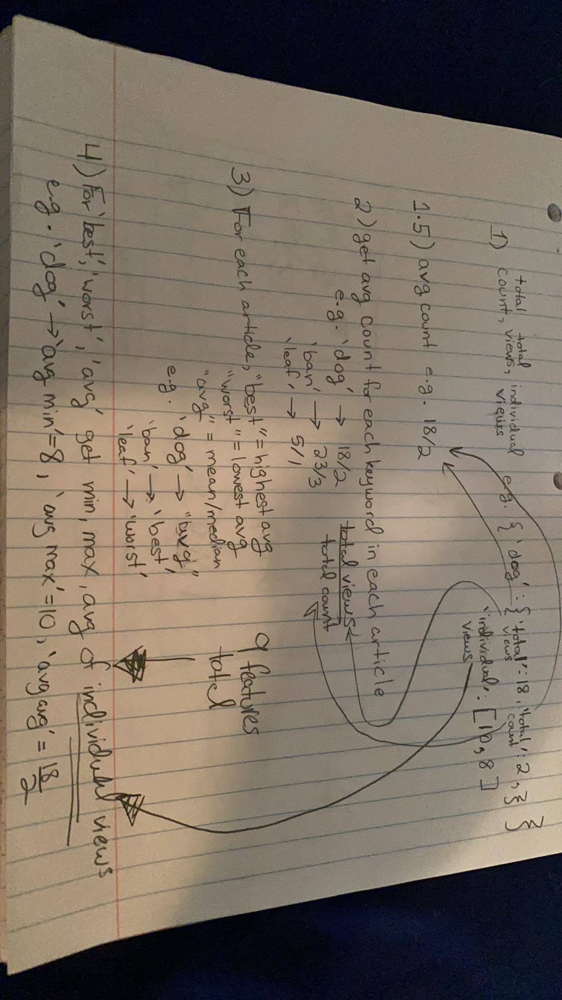

## Overview:  
This project goal is to predict online news popularity. The initial interest stemmed from the [UCI Machine Learning Repository](https://archive.ics.uci.edu/ml/datasets/Online+News+Popularity#).
With previous attempts by many researchers before us, we are using Regression to get a continuous outcome on newly scraped data.  

## Team members:
- Alice Hua , [@alicehua11](https://github.com/alicehua11)
- Haley Farber [@hfarb](https://github.com/hfarb)
- Derrick Xiong [@DerrickXZY](https://github.com/DerrickXZY)

## Data:  
Previous Data - [Mashable](https://mashable.com/) - 40k   
Our New Data - [Forbes](https://www.forbes.com/) - 7k  
Issues:  
Articles are mostly in Nov 2020, dynamic page, less standardized HTML than Mashable, harder to scrape.
Given the language difference, we don't expect to get the same result.  
Use WaybackMachine, InternetArchive to get past data, for each month and each topic for the entire year of 2020.  
The key issue is to not scrape the same website more than once, harder to catch than expected.  
Tried scraping nested links for more articles.  

## Features:   
We tried to get as close as possible to the original features. We got 53 out of 60 features with our own additional features for a total of 65.  
For the keyword features, previous authors did not mention the details of how some of the features were engineered the in the original 2015 paper by K. [Fernandes, P. Vinagre and P. Cortez](https://www.researchgate.net/publication/283510525_A_Proactive_Intelligent_Decision_Support_System_for_Predicting_the_Popularity_of_Online_News). Thefore, we came up with our own calculation method, thanks to [@GurditC](https://github.com/GurditC).  

## Model(s):
We tried OLS, RANSAC (Random Sample Consensus), Ridge (L2-norm regularization). RANSAC performed the best out of the three.  

## Result:  
After many iterations of Regression models, given the distribution of our data, special care needs to be taken in handling the outlier and high variance in our data.  
Our regression model provides a good baseline for the prediction of views, but better models could be implemented with more data. Moreover, our data collection and feature engineering process could be generalized to collect more data from many different sources other than Forbes to create more diverse and robust datasets for future research endeavor beyond the prediction of views and popularity.

## Limitations:  
Too many data points in November, and thus not enough data to train
The topics are not evenly distributed.
Given the distribution of the data, regression might not be the best model for the job. We found because our data has a lot of variance as well as a fat-tailed distribution, regression cannot fully capture that, a neural network with more data to train can potentially improve the results more.

## Files:  
There are three notebooks, Data_Gathering.ipynb, Feature_Engineering.ipynb and Regression_Models.ipynb in progression of the project.  
The final data file is located in Data folder.  
 
